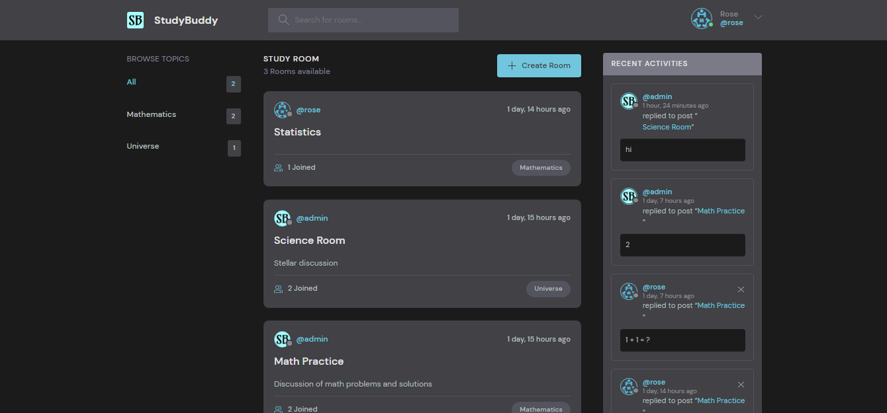
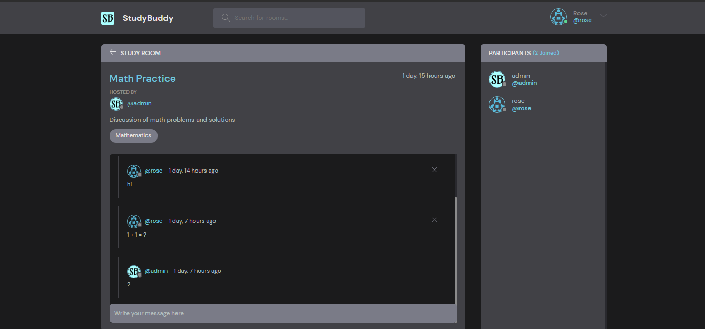
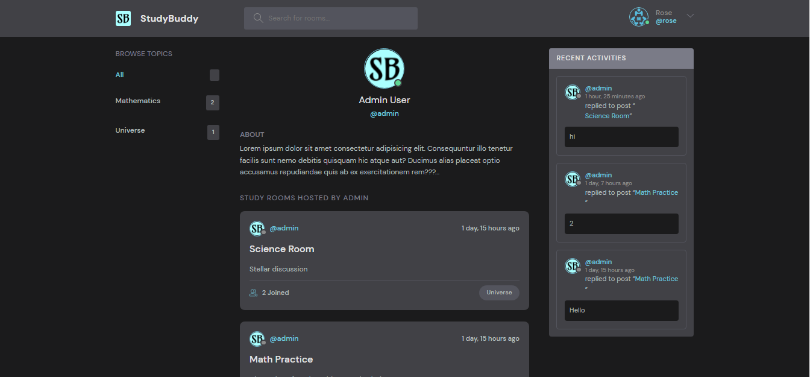

# StudyBuddy
A chat system wherein users can discuss in topic-wise chatrooms. Users also have ability to create chatrooms and filter by room name or topic

### Home Page
<!--  -->

### Chat Room
<!--  -->

### Profile
<!--  -->

